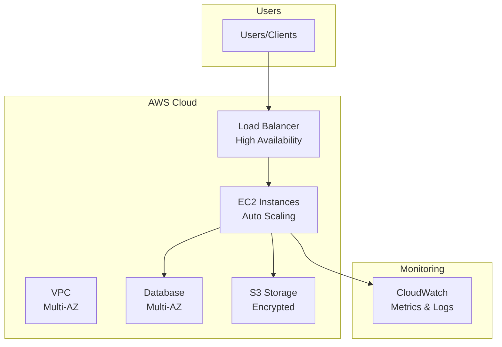

# 🔒 Enterprise Security & Compliance - CDKTF Go

> **Security-first infrastructure** with KMS encryption, CloudTrail auditing, and 12 AWS services

[](https://www.terraform.io/cdktf)
[](https://aws.amazon.com/)

## 🎯 Problem
Enterprise needs security-first infrastructure with encryption, auditing, private VPC, no shared credentials.

## 💡 Solution
CDKTF Go implementation with KMS encryption everywhere, CloudTrail logging, private VPC, IAM roles, SSL/TLS, detailed monitoring.

## 🏗️ Architecture

### High-Level Architecture




## 🚀 Quick Deploy
```bash
go mod download
cdktf deploy
```

## 💰 Cost: ~$60-80/month
## ⏱️ Deploy: 15-20 minutes

## ✨ Features
- ✅ KMS encryption (all resources)
- ✅ CloudTrail audit logging
- ✅ Private VPC architecture
- ✅ IAM roles (no credentials)
- ✅ SSL/TLS everywhere
- ✅ Detailed CloudWatch monitoring

## 🎯 Perfect For
- Financial services
- Healthcare (HIPAA)
- Enterprise compliance
- Security-critical apps

## 👤 Author
**Rahul Ladumor** | rahuldladumor@gmail.com | acloudwithrahul.in

## 📄 License
MIT - Copyright (c) 2025 Rahul Ladumor
